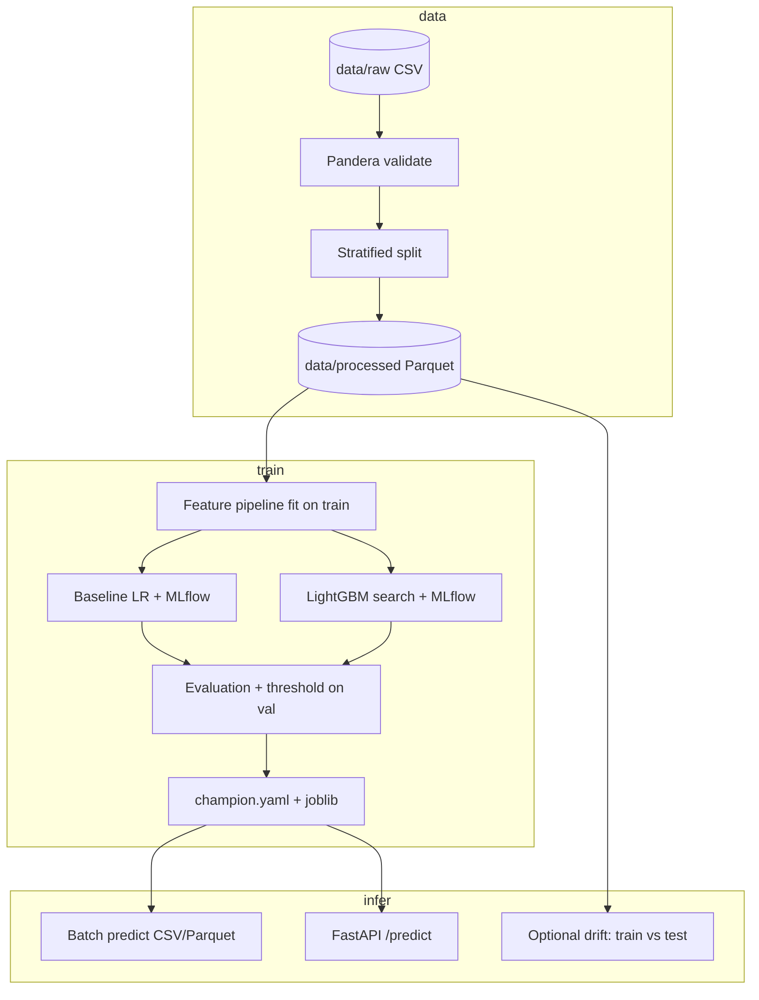

# Customer churn MLOps pipeline

[](https://github.com/brunoramosmartins/customer-churn-mlops-pipeline/actions/workflows/ci.yml)
[](https://www.python.org/downloads/)
[](LICENSE)
[](CHANGELOG.md)

End-to-end machine learning project for **Telco customer churn** (binary classification), structured for a portfolio-ready, production-minded workflow: data validation, feature engineering, training, evaluation, experiment tracking, packaging, API serving, and monitoring.

**Portfolio release `v1.0.1`** — [CHANGELOG.md](CHANGELOG.md) · `pyproject.toml` version **1.0.1** · [Contributing](CONTRIBUTING.md) · [Security](SECURITY.md).

## Contents

- [Quick start](#quick-start-reproduce-the-core-flow)
- [Results](#results-holdout-champion-model)
- [Primary metrics](#primary-metrics)
- [Architecture](#architecture)
- [Dataset citation](#dataset-citation)
- [Limitations](#limitations)
- [Problem statement](#problem-statement-phase-1) (Phase 1) and [phase-by-phase commands](#environment-setup) below

## Quick start: reproduce the core flow

You need the **full Telco CSV** (not committed) under `data/raw/` — see [Dataset citation](#dataset-citation). From the repository root:

```bash
python -m venv .venv
# Windows: .venv\Scripts\activate  —  macOS/Linux: source .venv/bin/activate
pip install -e ".[dev,portfolio]"
pytest -q

churn-validate
churn-split
churn-features
churn-train-baseline
churn-train-lightgbm
churn-evaluate
```

Optional next steps: **batch** `churn-batch-predict -i data/raw/WA_Fn-UseC_-Telco-Customer-Churn.csv` · **API** `churn-serve` (then `/health`, `/predict`) · **drift** `churn-drift --config configs/drift_report.yaml` (needs `data/processed/` splits).

CI does **not** need the full CSV: it runs `pytest` against `tests/fixtures/telco_sample.csv`.

## Results (holdout, champion model)

The champion is the **LightGBM** pipeline selected after Phase 7; the **classification threshold is chosen on validation only** (recall floor + F-beta), then applied once on **test**. Numbers below match the **committed** snapshot in [`reports/evaluation_summary.json`](reports/evaluation_summary.json) and [`reports/evaluation_summary.md`](reports/evaluation_summary.md); they will change if you retrain or resplit.

| | Validation | Test (one-shot) |
|--|--:|--:|
| **ROC-AUC** | 0.833 | 0.851 |
| **Average precision** | 0.637 | 0.658 |
| **Recall (churn)** at operating threshold | 0.804 | 0.843 |
| **Precision (churn)** at operating threshold | 0.507 | 0.519 |
| **F1** at operating threshold | 0.622 | 0.642 |

**Frozen threshold** (from validation): **0.47** — see [`configs/champion.yaml`](configs/champion.yaml). Figures: `reports/figures/phase8_*.png`.

## Primary metrics

Contract in [`configs/metrics.yaml`](configs/metrics.yaml) and narrative in [`docs/PROBLEM.md`](docs/PROBLEM.md): binary **Churn** (`Yes` / `No`), focus on **ROC-AUC**, **average precision**, **F1**, **recall on churn** (missing churners are treated as costly in the problem framing). Phase 8 applies a **minimum recall on churn** on validation when scanning thresholds.

## Architecture

Training and inference share one **sklearn `Pipeline`** (preprocess + classifier) serialized with **joblib**. **MLflow** tracks baseline and tuning runs; **Pandera** validates raw rows; **Pydantic** validates single-row API/batch inference.



Wider ASCII diagram and workflow conventions: [docs/ML_PROJECT_ROADMAP.md — Architecture Overview](docs/ML_PROJECT_ROADMAP.md#architecture-overview-ascii).

## Dataset citation

The project uses the **IBM Telco Customer Churn** tabular dataset (customer demographics, services, charges, and a `Churn` label). It is **not redistributed** in this repository. A common download location is **Kaggle** — [Telco Customer Churn](https://www.kaggle.com/datasets/blastchar/telco-customer-churn) — saved locally as `data/raw/WA_Fn-UseC_-Telco-Customer-Churn.csv`. Record provenance (URL, SHA256, row count) in [`data/raw/README.md`](data/raw/README.md) for reproducibility.

## Limitations

- **Portfolio scope:** no calibration curves, no feature store, no model registry/A/B pipeline, no production alerting.
- **Single static snapshot:** one stratified split and one champion path; drift tooling is a **univariate demo** ([docs/DRIFT.md](docs/DRIFT.md)), not operational monitoring.
- **Class imbalance:** handled via `class_weight` / LightGBM imbalance settings; business costs are discussed qualitatively in `docs/PROBLEM.md`, not as a live cost matrix in code.
- **Environment:** optional Docker image for the API; training is expected to run on your machine or CI with sufficient RAM for LightGBM.
- **Regenerated reports:** after `churn-evaluate`, summary paths are stored **relative to the repo** for portability; if you open an old local file with absolute paths, re-run evaluation to refresh.

## Problem statement (Phase 1)

- **Human-readable:** [docs/PROBLEM.md](docs/PROBLEM.md) — business goal, ML task, metrics, cost of errors, threshold policy.
- **Machine-readable:** [configs/metrics.yaml](configs/metrics.yaml) — same contract for code.
- **Python API:** `churn_ml.metrics` (`target_column()`, `positive_class_label()`, `primary_metrics()`, …).

## Roadmap and workflow

**[docs/ML_PROJECT_ROADMAP.md](docs/ML_PROJECT_ROADMAP.md)** — phases, GitHub conventions, architecture, issues, scripts.

## Environment setup

```bash
python -m venv .venv
.venv\Scripts\activate          # Windows — on macOS/Linux: source .venv/bin/activate
pip install -e ".[dev,portfolio]"
pytest -q
```

CI installs **`.[dev,portfolio]`** so Phase 10 API and drift tests run. Core training still works with `pip install -e ".[dev]"` if you skip serving locally.

## Data — full Telco file (manual)

The production-sized CSV is **gitignored**. After you download it (e.g. [Kaggle Telco Customer Churn](https://www.kaggle.com/datasets/blastchar/telco-customer-churn)), save it as `data/raw/WA_Fn-UseC_-Telco-Customer-Churn.csv`, fill in **source URL + `sha256` + row count** in [`data/raw/README.md`](data/raw/README.md), then validate:

```bash
pip install -e .
python -m churn_ml.data.validate
# or: churn-validate
```

## EDA (Phase 3)

Lean, reproducible summaries (no auto-profiling stack): class balance, missing values, categorical cardinality, numeric correlations with churn, figures, and modeling notes. **Stratify on `Churn` in Phase 4** is stated in the generated Markdown.

- **Leakage checklist:** [docs/EDA_LEAKAGE_CHECKLIST.md](docs/EDA_LEAKAGE_CHECKLIST.md)
- **CLI** (default input = `data/raw/WA_Fn-UseC_-Telco-Customer-Churn.csv` if present):

```bash
python -m churn_ml.eda.run -i tests/fixtures/telco_sample.csv -o reports
python -m churn_ml.eda.run
# or: churn-eda …
```

Outputs: `reports/eda_summary.md`, `reports/eda_summary.json`, `reports/figures/`.

- **Notebooks:** [notebooks/01_eda.ipynb](notebooks/01_eda.ipynb) (EDA) · [notebooks/02_pipeline_walkthrough.ipynb](notebooks/02_pipeline_walkthrough.ipynb) (sequential walkthrough: same `churn_ml` steps as the CLIs + design notes) · [notebooks/README.md](notebooks/README.md)

## Train / val / test split (Phase 4)

Stratified split on the churn column (`configs/metrics.yaml`), fixed seed, ratios in **`configs/split.yaml`**. Writes **`train.parquet`**, **`validation.parquet`**, **`test.parquet`**, and **`split_manifest.json`** under `data/processed/` (or `-o`). `TotalCharges` and `SeniorCitizen` are normalized before split.

```bash
# Default: reads data/raw/WA_Fn-UseC_-Telco-Customer-Churn.csv, writes data/processed/
python -m churn_ml.data.split
# Explicit paths:
python -m churn_ml.data.split -i path/to/raw.csv -o data/processed
# or: churn-split …
```

Omit `--skip-validation` when using real raw data (Pandera check). The tiny CI fixture has only four rows and is **not** enough for stratified 70/15/15; use the full Kaggle CSV (or any sample with enough rows per class in each split).

## Feature engineering (Phase 5)

Single sklearn **`Pipeline`** with a **`ColumnTransformer`**: numeric columns → median imputation + `StandardScaler`; categoricals → most-frequent imputation + **one-hot** (`handle_unknown='ignore'` for val/test). **Fit on `train.parquet` only**; artifacts are written under **`models/`** (gitignored).

- **Config:** [`configs/features.yaml`](configs/features.yaml) — ID column, numeric vs categorical lists, encoding note.
- **Outputs:** `models/feature_pipeline.joblib`, `models/feature_manifest.json` (`n_features_out`, feature names, per-column train cardinalities).

```bash
# Requires data/processed/train.parquet (Phase 4)
python -m churn_ml.features.run
python -m churn_ml.features.run -t data/processed/train.parquet -o models -c configs/features.yaml
# or: churn-features …
```

Phases 6–7 append a classifier to the same preprocess `Pipeline` (or you can load `feature_pipeline.joblib` and chain a model separately).

## Baseline model and MLflow (Phase 6)

End-to-end **`Pipeline`** (preprocess from Phase 5 + **logistic regression**), **fit on train only**, metrics on **validation** (`val_roc_auc`, `val_average_precision`, `val_f1`, `val_recall_churn`). **`class_weight: balanced`** is configurable in YAML when classes are imbalanced.

- **Config:** [`configs/train_baseline.yaml`](configs/train_baseline.yaml) — LR hyperparameters, MLflow experiment / run name.
- **Artifacts:** `models/baseline.joblib` (full fitted pipeline); MLflow stores runs under **`mlruns/`** (gitignored) unless you point elsewhere.

**Tracking URI:** set `MLFLOW_TRACKING_URI` for a remote store or shared folder; if unset, the default is a **local file store** `./mlruns` (relative to the process working directory).

```bash
# Requires data/processed/train.parquet and validation.parquet (Phase 4)
# Optional: custom store — Windows CMD: set MLFLOW_TRACKING_URI=file:./mlruns
# PowerShell: $env:MLFLOW_TRACKING_URI="file:./mlruns"  ·  Unix: export MLFLOW_TRACKING_URI=file:./mlruns
python -m churn_ml.models.run_baseline
python -m churn_ml.models.run_baseline --tracking-uri file:./mlruns
# or: churn-train-baseline …

mlflow ui --backend-store-uri file:./mlruns
# Then open http://127.0.0.1:5000
```

## LightGBM tuning (Phase 7)

**LightGBM only** (no RF/XGB sprawl): same preprocess as Phases 5–6, **`RandomizedSearchCV`** with **stratified K-fold on the train split only** (`roc_auc` by default). After refit on full train, reports the **same validation metrics** as the baseline for apples-to-apples comparison in MLflow. **`test.parquet` is not used** for tuning (reserved for Phase 8).

- **Search space:** [`configs/tune_lightgbm.yaml`](configs/tune_lightgbm.yaml) — `n_splits`, `n_iter`, `param_distributions`, fixed `lightgbm` kwargs (`is_unbalance`, etc.).
- **Outputs:** `models/lightgbm_tuned.joblib` (default) and auto-generated [`configs/lightgbm_best.yaml`](configs/lightgbm_best.yaml) (best hyperparameters + validation snapshot).
- **MLflow:** parent run + **nested runs** per search trial (`cv_mean_roc_auc`, `cv_std_roc_auc`); parent logs best CV score, `val_*` metrics, and model artifacts. Use the same `experiment_name` as the baseline to compare runs in the UI.

```bash
python -m churn_ml.models.run_lightgbm
python -m churn_ml.models.run_lightgbm --tune-config configs/tune_lightgbm.yaml -o models/lightgbm_tuned.joblib
# or: churn-train-lightgbm …
```

## Evaluation and threshold (Phase 8)

**Threshold is chosen on validation only** (grid over predicted churn probability): enforce minimum **recall on churn** from `configs/metrics.yaml` (`suggested_minimum_recall_churn`) unless overridden in [`configs/eval.yaml`](configs/eval.yaml), then **maximize F-beta** (values of beta above 1 weight recall more) among feasible thresholds. **Test** is scored **once**: ranking metrics (ROC-AUC, average precision) and confusion-based metrics at the **frozen** validation threshold — no threshold tuning on test.

- **Champion model:** defaults to `models/lightgbm_tuned.joblib`, falls back to `models/baseline.joblib` if missing.
- **Outputs:** figures under `reports/figures/` (`phase8_*`), [`reports/evaluation_summary.json`](reports/evaluation_summary.json), [`reports/evaluation_summary.md`](reports/evaluation_summary.md), frozen [`configs/champion.yaml`](configs/champion.yaml) for Phase 9+.
- **Calibration plots** are intentionally out of scope for portfolio v1 (roadmap).

```bash
python -m churn_ml.evaluation.run
# or: churn-evaluate
# Optional: --champion path/to/model.joblib  ·  --root .  (for resolving relative paths in eval.yaml)
```

## Packaging and batch inference (Phase 9)

Load the **frozen champion** from [`configs/champion.yaml`](configs/champion.yaml) (joblib `Pipeline` + threshold), validate each input row with a **Pydantic** model derived from [`configs/features.yaml`](configs/features.yaml) (`extra="forbid"` — unknown columns fail fast), then write **CSV or Parquet** with `churn_probability`, `predicted_churn` (`Yes`/`No`), and `actual_churn` if the input included the target column.

- **Config:** [`configs/batch_predict.yaml`](configs/batch_predict.yaml) — manifest path, default output (`predictions/batch_predictions.parquet`), metadata path, `artifact_version` string.
- **Metadata:** [`reports/batch_predict_metadata.json`](reports/batch_predict_metadata.json) — UTC timestamp, optional `git_sha`, `input_sha256`, resolved model path, threshold, row count (use `--no-metadata` to skip).

```bash
python -m churn_ml.batch_predict.run -i data/raw/WA_Fn-UseC_-Telco-Customer-Churn.csv
python -m churn_ml.batch_predict.run -i sample.parquet -o predictions/scored.parquet
# or: churn-batch-predict …
```

Batch outputs under `predictions/` are **gitignored** (except `.gitkeep`). Copy the champion joblib to a versioned name (e.g. `models/champion_v1.joblib`) in your release process if you want a stable path; `artifact_version` in metadata records the logical label.

## HTTP API and drift (Phase 10)

**Serving:** FastAPI loads the champion pipeline and threshold at startup (same contract as batch: [`configs/champion.yaml`](configs/champion.yaml), [`configs/features.yaml`](configs/features.yaml)). Optional env: `CHURN_PROJECT_ROOT`, `CHURN_CHAMPION_MANIFEST`, `CHURN_FEATURES_CONFIG`.

```bash
pip install -e ".[portfolio]"
churn-serve
# or: python -m churn_ml.serve.cli
```

**Health**

```bash
curl -s http://127.0.0.1:8000/health
```

**Predict** (one JSON object per request — same fields as a Telco row; `Churn` optional)

```bash
curl -s -X POST http://127.0.0.1:8000/predict ^
  -H "Content-Type: application/json" ^
  -d "{\"customerID\":\"7590-VHVEG\",\"gender\":\"Female\",\"SeniorCitizen\":0,\"Partner\":\"Yes\",\"Dependents\":\"No\",\"tenure\":1,\"PhoneService\":\"No\",\"MultipleLines\":\"No phone service\",\"InternetService\":\"DSL\",\"OnlineSecurity\":\"No\",\"OnlineBackup\":\"No\",\"DeviceProtection\":\"No\",\"TechSupport\":\"No\",\"StreamingTV\":\"No\",\"StreamingMovies\":\"No\",\"Contract\":\"Month-to-month\",\"PaperlessBilling\":\"Yes\",\"PaymentMethod\":\"Electronic check\",\"MonthlyCharges\":29.85,\"TotalCharges\":null}"
```

On **bash**, use a single-quoted JSON body or a `heredoc` instead of `^` line continuation.

**Drift (reference vs current table):** univariate KS + chi-square on modeling columns; outputs `reports/drift_report.html` and `reports/drift_summary.json`. Conceptual note: [docs/DRIFT.md](docs/DRIFT.md). Defaults: [`configs/drift_report.yaml`](configs/drift_report.yaml).

```bash
python -m churn_ml.monitoring.run_drift --config configs/drift_report.yaml
# or: churn-drift --config configs/drift_report.yaml
```

**Docker (optional):** [docker/README.md](docker/README.md).

## Repository layout (summary)

| Path | Purpose |
|------|---------|
| `configs/` | `metrics.yaml`, `eval.yaml`, `champion.yaml`, `batch_predict.yaml`, training/tuning YAMLs, … |
| `data/raw/` | Raw CSV (gitignored; see `data/raw/README.md`) |
| `data/processed/` | Train / validation / test artifacts |
| `docs/` | Roadmap, **PROBLEM.md**, **DRIFT.md**, **EDA_LEAKAGE_CHECKLIST.md** |
| `models/` | Serialized pipelines (gitignored) |
| `notebooks/` | EDA + end-to-end walkthrough (`_walkthrough_outputs/` gitignored) |
| `predictions/` | Batch scoring outputs (gitignored except `.gitkeep`) |
| `reports/` | Figures (`phase8_*`, EDA), `evaluation_summary.*`, `batch_predict_metadata.json`, optional `drift_report.html` / `drift_summary.json` |
| `scripts/` | GitHub CLI automation |
| `src/churn_ml/` | `metrics`, `data`, `eda`, `features`, `models`, `evaluation`, `batch_predict`, `serve`, `monitoring` |
| `tests/` | Pytest + `fixtures/telco_sample.csv` for CI |

## GitHub automation (Bash + `gh`)

On **macOS**, **Linux**, or **Git Bash / WSL** on Windows:

```bash
gh auth login
chmod +x scripts/*.sh
./scripts/create_labels.sh
./scripts/create_milestones.sh
./scripts/create_issues.sh
```

## Status

| Phase | Status |
|-------|--------|
| 0 — Bootstrap | `pyproject.toml`, package layout, CI workflow |
| 1 — Problem & metrics | **Done** — `docs/PROBLEM.md`, `configs/metrics.yaml`, `churn_ml.metrics` |
| 2 — Ingestion & validation | **Done** in code — Pandera schema, CLI, fixture; **you** still download full CSV + fill `sha256` in `data/raw/README.md` |
| 3 — EDA | **Done** — `churn_ml.eda`, `churn-eda` / `python -m churn_ml.eda.run`, `docs/EDA_LEAKAGE_CHECKLIST.md`, `notebooks/01_eda.ipynb` |
| 4 — Split | **Done** — `churn_ml.data.split`, `churn-split` / `python -m churn_ml.data.split`, `configs/split.yaml`, Parquet + manifest under `data/processed/` |
| 5 — Features | **Done** — `churn_ml.features`, `churn-features` / `python -m churn_ml.features.run`, `configs/features.yaml`, `feature_pipeline.joblib` + manifest under `models/` |
| 6 — Baseline + MLflow | **Done** — `churn_ml.models`, `churn-train-baseline` / `python -m churn_ml.models.run_baseline`, `configs/train_baseline.yaml`, `models/baseline.joblib`, `mlruns/` (local or remote via `MLFLOW_TRACKING_URI`) |
| 7 — LightGBM | **Done** — `churn-train-lightgbm` / `python -m churn_ml.models.run_lightgbm`, `configs/tune_lightgbm.yaml`, `configs/lightgbm_best.yaml`, `models/lightgbm_tuned.joblib`, MLflow nested trials |
| 8 — Evaluation | **Done** — `churn-evaluate` / `python -m churn_ml.evaluation.run`, `configs/eval.yaml`, threshold on val, test one-shot, `reports/evaluation_summary.*`, `configs/champion.yaml` |
| 9 — Batch inference | **Done** — `churn-batch-predict` / `python -m churn_ml.batch_predict.run`, Pydantic rows, `configs/batch_predict.yaml`, `predictions/` + metadata JSON |
| 10 — Serving & monitoring | **Done** — `churn-serve` / FastAPI `/health` + `/predict`, `churn-drift` / `docs/DRIFT.md`, optional `docker/` |
| 11 — Documentation & release | **Done** — README quick start, results table, Mermaid architecture, limitations, dataset citation, [CHANGELOG.md](CHANGELOG.md), `v1.0.x` |
| 12+ | Backlog (roadmap) |

## License

See [LICENSE](LICENSE).
